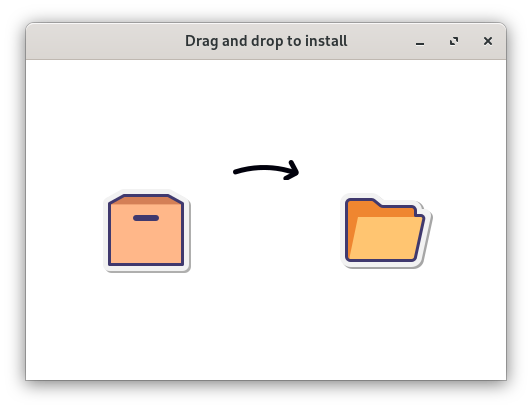

# Dnd2Install


A drag and drop installer for Linux.

<p align="center">
  
</p>

## Get started

### Install

- Download package from [Releases](https://github.com/eduhds/dnd2install/releases)

```sh
# Debian
wget https://github.com/eduhds/dnd2install/releases/download/v1.0.0/dnd2install-v1.0.0-x86_64.deb
sudo apt install -y ./dnd2install*.deb

# Fedora
wget https://github.com/eduhds/dnd2install/releases/download/v1.0.0/dnd2install-v1.0.0-x86_64.rpm
sudo dnf install -y ./dnd2install*.rpm
```

### Usage

1. Right click on file `.rpm`, `.deb` or tarballs
2. Click "Open with" > "Drag and drop to install"

## Credits

- [webview/webview](https://github.com/webview/webview)

- <a  href="https://icons8.com/icon/kTr9DhKidICy/packing">Packing</a>, <a  href="https://icons8.com/icon/gGQqaCyJ5Auh/empty-box">Empty Box</a>, <a  href="https://icons8.com/icon/SauwBNNErOqo/opened-folder">Opened Folder</a> icons by <a href="https://icons8.com">Icons8</a>
